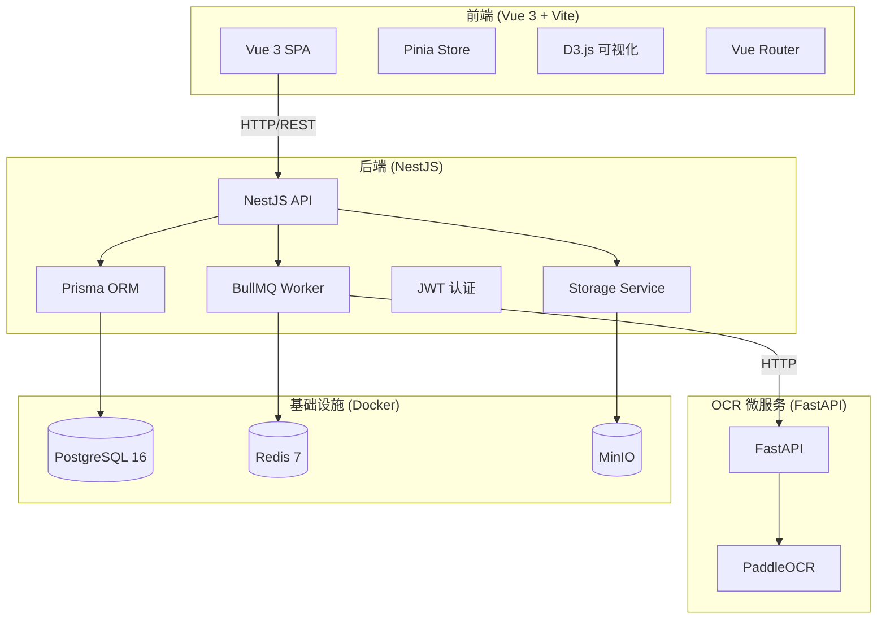

# 1. 技术栈总览

## 项目类型

**Web 应用程序**（前后端分离 + OCR 微服务）

## 仓库结构

**Monorepo**（npm workspaces），包含三个子应用：

| 子应用 | 路径 | 类型 | 语言 |
|--------|------|------|------|
| API 服务 | `apps/api` | 后端 REST API | TypeScript |
| Web 前端 | `apps/web` | SPA 单页应用 | TypeScript / Vue |
| OCR 服务 | `apps/ocr-service` | 独立微服务 | Python |

## 后端（apps/api）

| 分类 | 技术 | 版本 |
|------|------|------|
| **运行时** | Node.js | — |
| **框架** | NestJS | ^10.4.8 |
| **ORM** | Prisma Client | ^5.22.0 |
| **认证** | Passport + JWT（`@nestjs/jwt`, `passport-jwt`） | ^10.2.0 / ^4.0.1 |
| **验证** | class-validator + class-transformer | ^0.14.1 / ^0.5.1 |
| **任务队列** | BullMQ（基于 Redis） | ^5.10.4 |
| **对象存储** | MinIO client（兼容本地文件系统回退） | ^8.0.2 |
| **PDF 生成** | pdf-lib + @pdf-lib/fontkit | ^1.17.1 / ^1.1.1 |
| **HTTP 客户端** | axios | ^1.7.7 |
| **测试** | Jest + ts-jest | ^29.7.0 |
| **构建** | NestJS CLI + TypeScript | ^10.4.5 / ^5.6.3 |

## 前端（apps/web）

| 分类 | 技术 | 版本 |
|------|------|------|
| **UI 框架** | Vue 3（Composition API + `<script setup>`） | ^3.5.12 |
| **状态管理** | Pinia | ^2.2.6 |
| **路由** | Vue Router | ^4.4.5 |
| **可视化** | D3.js（族谱树状图/吊线图） | ^7.9.0 |
| **HTTP** | axios | ^1.7.7 |
| **工具库** | @vueuse/core | ^10.11.1 |
| **截图导出** | html-to-image | ^1.11.13 |
| **构建工具** | Vite | ^5.4.10 |
| **类型检查** | vue-tsc | ^2.1.8 |
| **CSS** | 原生 CSS（CSS Variables + 主题系统） | — |

## OCR 服务（apps/ocr-service）

| 分类 | 技术 | 版本 |
|------|------|------|
| **框架** | FastAPI | 0.115.0 |
| **ASGI 服务器** | uvicorn | 0.31.0 |
| **数据校验** | Pydantic | 2.9.2 |
| **OCR 引擎** | PaddleOCR | 2.8.1 |
| **HTTP** | requests | 2.32.3 |
| **图像处理** | Pillow | 10.4.0 |

## 基础设施依赖（Docker Compose）

| 服务 | 镜像 | 端口 | 用途 |
|------|------|------|------|
| PostgreSQL | postgres:16 | 5432 | 主数据库 |
| Redis | redis:7 | 6379 | BullMQ 任务队列 |
| MinIO | minio/minio:latest | 9000 / 9001 | 对象存储（族谱源文件、导出 PDF） |

## 技术栈关系图

