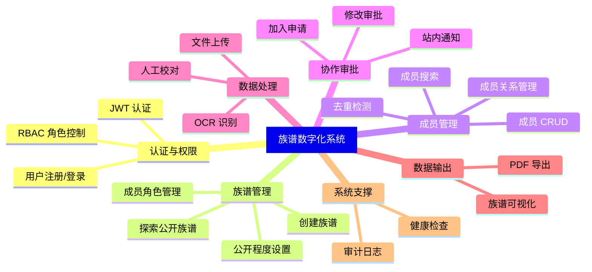

# 3. 项目功能分析

## 用户角色

系统定义了 **5 种角色**，按权限从高到低排列：

| 角色 | 权限等级 | 说明 |
|------|---------|------|
| `admin` | 100 | 系统管理员，拥有最高权限 |
| `creator` | 80 | 族谱创建者，创建族谱时自动授予 |
| `collaborator` | 60 | 协作者，需申请审批后获得 |
| `editor` | 60 | **已废弃**，保留兼容旧数据，等同 collaborator |
| `viewer` | 20 | 普通查看者，只读权限 |

> 权限支持**继承**：高权限角色自动拥有低权限角色的所有能力。

## 核心功能模块

### 模块总览

---

### 模块 1：认证与权限管理

**功能描述**：用户注册、登录、JWT Token 签发与验证，以及基于角色的访问控制。

| 功能 | 描述 |
|------|------|
| 注册 | 用户名 + 密码注册，SHA256 哈希存储 |
| 登录 | 验证凭据，签发 JWT（payload 含 userId, username, familyId, role） |
| 获取用户信息 | 查询用户所有族谱角色列表 |
| RBAC 守卫 | 通过 `@Roles()` 装饰器 + `RolesGuard` 实现接口级权限控制 |

**代码映射**：

| 层级 | 文件 |
|------|------|
| Controller | `modules/auth/auth.controller.ts` |
| Service | `modules/auth/auth.service.ts` |
| JWT Strategy | `modules/auth/jwt.strategy.ts` |
| JWT Guard | `modules/auth/jwt-auth.guard.ts` |
| 角色守卫 | `common/guards/roles.guard.ts` |
| 角色装饰器 | `common/decorators/roles.decorator.ts` |
| 类型定义 | `common/types.ts` |

---

### 模块 2：族谱管理

**功能描述**：族谱的创建、公开程度控制、用户角色分配、公开族谱探索。

| 功能 | 描述 |
|------|------|
| 创建族谱 | 创建者自动获得 `creator` 角色 |
| 探索族谱 | 搜索系统内公开族谱（排除已加入的） |
| 我的族谱 | 查询当前用户加入的所有族谱 |
| 公开程度 | `public`（公开） / `approval_required`（需审批） |
| 角色管理 | 查看/移除族谱成员角色（不允许移除创建者） |
| 自动解析 | `resolveByCode`：通过 code 查找族谱，不存在则自动创建（v0.1 兼容） |

**代码映射**：

| 层级 | 文件 |
|------|------|
| Controller | `infra/families/families.controller.ts` |
| Service | `infra/families/families.service.ts` |

---

### 模块 3：成员管理

**功能描述**：族谱成员的增删改查、亲属关系建立、重复检测。

| 功能 | 描述 |
|------|------|
| 创建成员 | 包含去重检测（同名同代），创建后记录审计日志 |
| 更新成员 | 修改成员信息，记录审计日志 |
| 删除成员 | **级联删除**关联关系后删除成员 |
| 查看成员关系 | 返回父母、子女、配偶三维关系 |
| 建立关系 | 支持 `parent_of`（父子）和 `spouse_of`（配偶），防止自关联和重复 |
| 成员搜索 | 按姓名/世代/字号模糊搜索，最多返回 100 条 |

**代码映射**：

| 层级 | 文件 |
|------|------|
| Controller | `modules/members/members.controller.ts` |
| Service | `modules/members/members.service.ts` |
| DTO | `modules/members/dto.ts` |
| 搜索 Controller | `modules/search/search.controller.ts` |
| 搜索 Service | `modules/search/search.service.ts` |

---

### 模块 4：协作审批体系（v0.2 新增）

**功能描述**：非创建者用户通过申请加入族谱或提交修改请求的审批流程。

#### 4a. 加入申请（Access Requests）

| 功能 | 描述 |
|------|------|
| 提交申请 | 选择角色类型（collaborator/viewer），填写理由 |
| 防重复 | 已有权限或待审批申请时拒绝 |
| 审批通过 | 自动授予角色 + 审计记录 + 通知申请者 |
| 审批拒绝 | 记录拒绝原因 + 通知申请者 |
| 自动通知 | 提交申请时通知创建者 |

#### 4b. 修改审批（Edit Requests）

| 功能 | 描述 |
|------|------|
| 提交修改 | 支持 5 种操作：`member_create` / `member_update` / `member_delete` / `relation_create` / `relation_delete` |
| 审批通过 | **自动执行**修改操作（解析 JSON payload → Prisma 操作） |
| 审批拒绝 | 通知协作者 |
| 要求修改 | 状态设为 `revision_needed`，通知协作者 |

#### 4c. 站内通知（Notifications）

| 功能 | 描述 |
|------|------|
| 获取通知 | 按时间倒序，最多 50 条 |
| 未读数量 | 前端每 10 秒轮询 |
| 标记已读 | 单条/全部标记 |
| 通知类型 | `access_request` / `access_approved` / `access_rejected` / `edit_request` / `edit_approved` / `edit_rejected` |

**代码映射**：

| 层级 | 文件 |
|------|------|
| 加入申请 Controller | `modules/access-requests/access-requests.controller.ts` |
| 加入申请 Service | `modules/access-requests/access-requests.service.ts` |
| 修改审批 Controller | `modules/edit-requests/edit-requests.controller.ts` |
| 修改审批 Service | `modules/edit-requests/edit-requests.service.ts` |
| 通知 Controller | `modules/notifications/notifications.controller.ts` |
| 通知 Service | `modules/notifications/notifications.service.ts` |

---

### 模块 5：数据处理（OCR）

**功能描述**：上传族谱源文件 → OCR 文字识别 → 人工校对确认 → 导入成员数据。

| 功能 | 描述 |
|------|------|
| 文件上传 | Multer 接收 → MinIO/本地存储 → 创建 SourceDocument 记录 |
| 创建 OCR 任务 | 投递到 BullMQ 队列异步处理 |
| OCR 识别 | Worker 生成预签名 URL → 调用 OCR 微服务 → 存储候选结果 |
| 人工校对 | 确认/修改 OCR 结果后批量创建成员记录 |

**代码映射**：

| 层级 | 文件 |
|------|------|
| 上传 Controller | `modules/uploads/uploads.controller.ts` |
| 上传 Service | `modules/uploads/uploads.service.ts` |
| OCR Controller | `modules/ocr/ocr.controller.ts` |
| OCR Service | `modules/ocr/ocr.service.ts` |
| OCR Worker | `modules/ocr/ocr.worker.ts` |
| Python 微服务 | `apps/ocr-service/main.py` |

---

### 模块 6：数据输出

#### 6a. 族谱可视化（v0.2 新增）

| 功能 | 描述 |
|------|------|
| 树状图数据 | 构建嵌套树结构，自动识别根节点和配偶关系 |
| 吊线图数据 | 按世代分组的扁平结构 |
| D3.js 渲染 | 前端使用 TreeChart / DropLineChart 组件渲染 |

#### 6b. PDF 导出

| 功能 | 描述 |
|------|------|
| 快速表格 | 成员信息表格（姓名、世代、字号、状态） |
| 吊线图 | 按世代网格排列的简化版吊线图 |
| 欧式行传 | 每人一段的传记体格式 |
| 中文字体 | 自动检测系统 CJK 字体，回退为 ASCII |

**代码映射**：

| 层级 | 文件 |
|------|------|
| 可视化 Controller | `modules/visualization/visualization.controller.ts` |
| 可视化 Service | `modules/visualization/visualization.service.ts` |
| 导出 Controller | `modules/exports/exports.controller.ts` |
| 导出 Service | `modules/exports/exports.service.ts` |
| 导出 Worker | `modules/exports/exports.worker.ts` |
| 前端 TreeChart | `components/viz/TreeChart.vue` |
| 前端 DropLineChart | `components/viz/DropLineChart.vue` |

---

### 模块 7：系统支撑

| 功能 | 描述 | 代码文件 |
|------|------|---------|
| 审计日志 | 记录成员/关系/申请的所有变更操作 | `modules/audits/audits.service.ts` |
| 健康检查 | API 存活检测端点 | `modules/health/` |

---

## 前端页面与路由

| 路由 | 页面组件 | 功能 |
|------|---------|------|
| `/` | → 重定向 `/members` | — |
| `/login` | `LoginPage.vue` | 登录/注册 |
| `/families` | `FamilyManagePage.vue` | 族谱管理（v0.2） |
| `/members` | `MembersPage.vue` | 成员列表 |
| `/members/:id` | `MemberDetailPage.vue` | 成员详情/关系 |
| `/visualization` | `VisualizationPage.vue` | 族谱可视化（v0.2） |
| `/ocr` | `OcrPage.vue` | OCR 管理 |
| `/exports` | `ExportsPage.vue` | 导出管理 |
| `/audits` | `AuditsPage.vue` | 审计日志 |
| `/requests` | `AccessRequestsPage.vue` | 申请审批（v0.2） |
