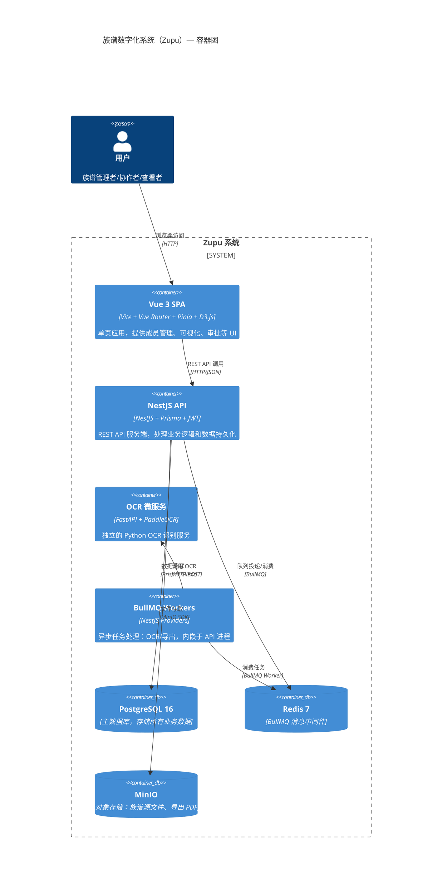
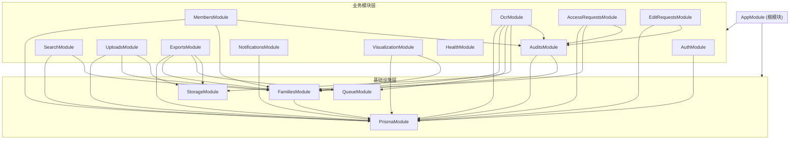
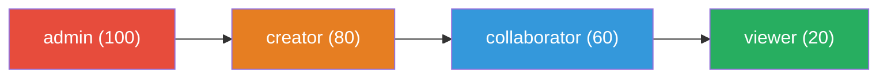
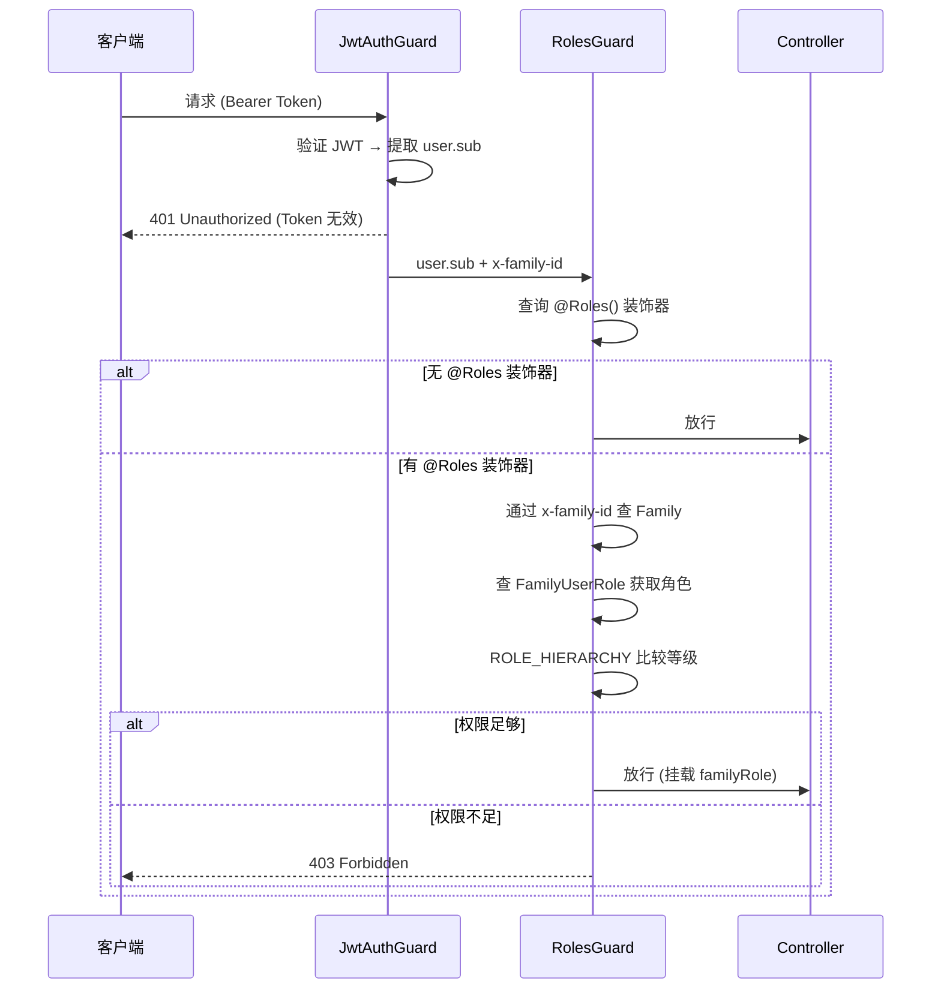
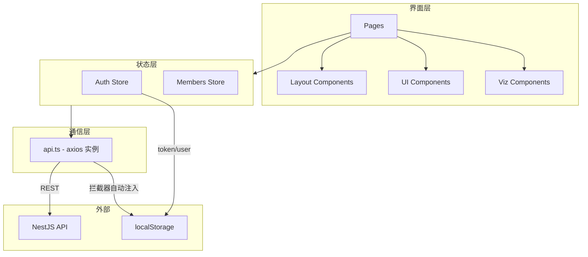

# 4. 系统架构

## 应用入口

### 后端入口（`apps/api/src/main.ts`）

```
NestFactory.create(AppModule)
  ├── app.enableCors()                    # 启用跨域
  ├── app.setGlobalPrefix('api')          # 全局路由前缀 /api
  ├── app.useGlobalPipes(ValidationPipe)  # 全局参数验证（whitelist + transform）
  └── app.listen(PORT)                    # 默认端口 3000
```

### 前端入口（`apps/web/src/main.ts`）

```
createApp(App)
  ├── app.use(pinia)     # Pinia 状态管理
  ├── app.use(router)    # Vue Router
  └── app.mount('#app')  # 挂载到 DOM
```

### OCR 微服务入口（`apps/ocr-service/main.py`）

```
FastAPI()
  ├── GET /health     # 健康检查
  └── POST /ocr       # OCR 文字识别
```

---

## C4 容器图



---

## 后端模块依赖关系



---

## RBAC 权限模型

### 权限继承等级



### 权限校验流程



### 各接口权限要求

| 模块 | 接口 | 最低权限 |
|------|------|---------|
| 成员管理 | 全部 CRUD | `JwtAuthGuard`（仅需登录） |
| 族谱管理 | 创建/探索/我的列表 | `JwtAuthGuard` |
| 族谱管理 | 修改公开程度/角色管理 | `admin` / `creator` |
| 加入申请 | 提交申请/我的申请 | `JwtAuthGuard` |
| 加入申请 | 查看/审批 | `admin` / `creator` / `collaborator` |
| 修改审批 | 提交修改 | `viewer`（注意：角色守卫实际继承，collaborator+ 可用） |
| 修改审批 | 查看/审批 | `admin` / `creator` |
| 可视化 | 树状图/吊线图 | `viewer`+ |
| 通知 | 全部接口 | `JwtAuthGuard` |

---

## 前端架构



### 前端认证机制

1. 登录成功后，`token` 和 `user` 对象存入 `localStorage`
2. axios 请求拦截器自动读取 `localStorage`，注入 `Authorization` 和 `x-family-id` 请求头
3. 路由守卫检查 `localStorage.token`，未登录时重定向到 `/login`
4. `App.vue` 挂载时调用 `loadUserInfo()` 刷新用户多族谱信息
