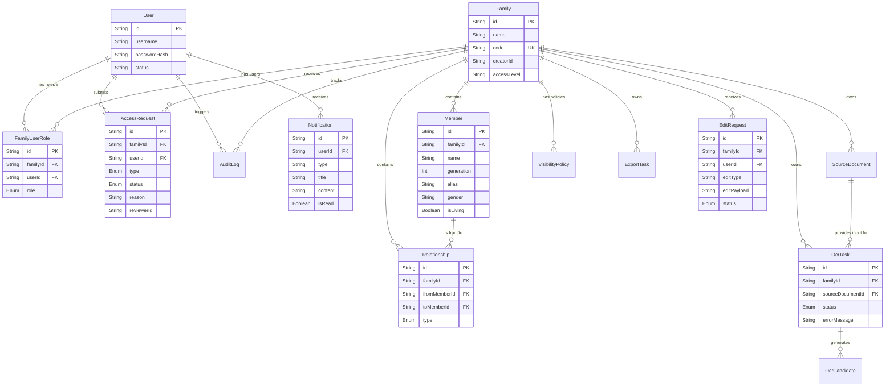

# 5. 数据模型分析

## Prisma Schema 解析

本项目使用 PostgreSQL 作为主数据库，并通过 Prisma 进行 ORM 映射和类型生成。

### 核心枚举 (Enums)

| 枚举名 | 值 | 用途 |
|---|---|---|
| `Role` | `admin`, `creator`, `collaborator`, `editor`(废弃), `viewer` | 定义用户在族谱中的权限等级 |
| `RelationType` | `parent_of`, `spouse_of` | 定义成员间的亲属关系类型 |
| `OcrTaskStatus` | `pending`, `running`, `succeeded`, `failed`, `reviewed` | 定义 OCR 识别任务的生命周期状态 |
| `ExportTaskStatus` | `pending`, `running`, `succeeded`, `failed` | 定义导出任务的生命周期状态 |
| `AccessRequestStatus` | `pending`, `approved`, `rejected` | 协作者/查看者申请状态 |
| `AccessRequestType` | `collaborator`, `viewer` | 申请的角色类型 |
| `EditRequestStatus` | `pending`, `approved`, `rejected`, `revision_needed` | 协作者修改请求的状态 |

### 数据模型抽象层

1.  **全局资源层**: `User`
2.  **租户/命名空间层**: `Family` (所有业务数据均隔离于特定的 Family 下)
3.  **权限控制层**: `FamilyUserRole`, `AccessRequest`
4.  **业务核心层**: `Member`, `Relationship`, `EditRequest`
5.  **异步处理层**: `SourceDocument`, `OcrTask`, `OcrCandidate`, `ExportTask`
6.  **监控审计层**: `AuditLog`, `Notification`

## Entity-Relationship (ER) 图

## 数据一致性与约束

1.  **级联删除 (Cascade Delete)**:
    -   删除 `Family` 时，其下的所有 `Member`, `Relationship`, `OcrTask` 等业务数据会**级联删除**。
    -   删除 `Member` 时，`members.service.ts` 会**手动清除**以该成员作为 `fromMemberId` 或 `toMemberId` 的所有 `Relationship`，以维持图谱关系的完整性。
2.  **唯一性约束 (Unique Constraints)**:
    -   `Family.code`: 族谱邀请码/标识必须唯一。
    -   `User.username`: 登录用户名必须唯一。
    -   `[familyId, userId]` 联合唯一索引: `FamilyUserRole` 中，一个用户在一个族谱只能有一个角色。
    -   `[familyId, fromMemberId, toMemberId, type]` 联合唯一索引: `Relationship` 中，相同的两人之间相同类型的关系只能存在一条。
3.  **JSON 存储**: `EditRequest.editPayload` 和 `OcrCandidate.bboxJson` 等字段因为结构多变，使用了 String 类型存储 JSON 数据（未采用原生 JSONB 是因为 Prisma 在跨数据库类型时 String 更兼容，但在强 PostgreSQL 环境中可优化）。
