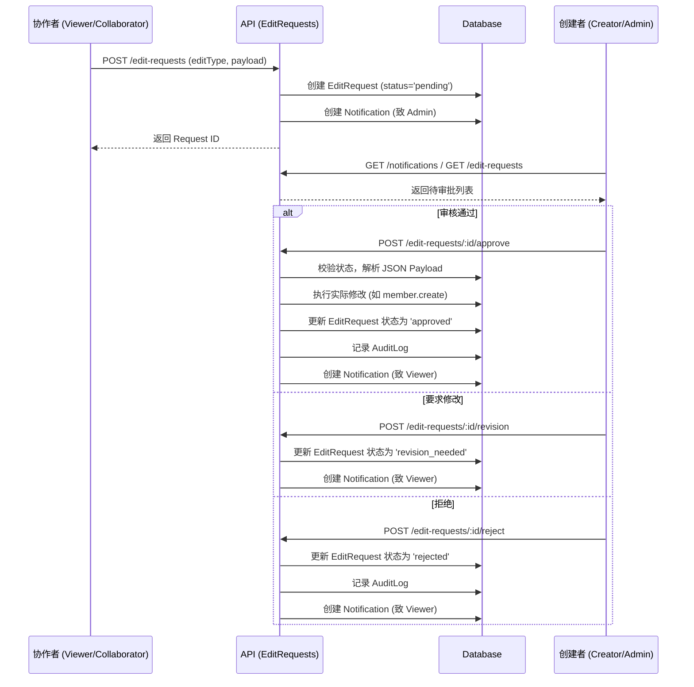
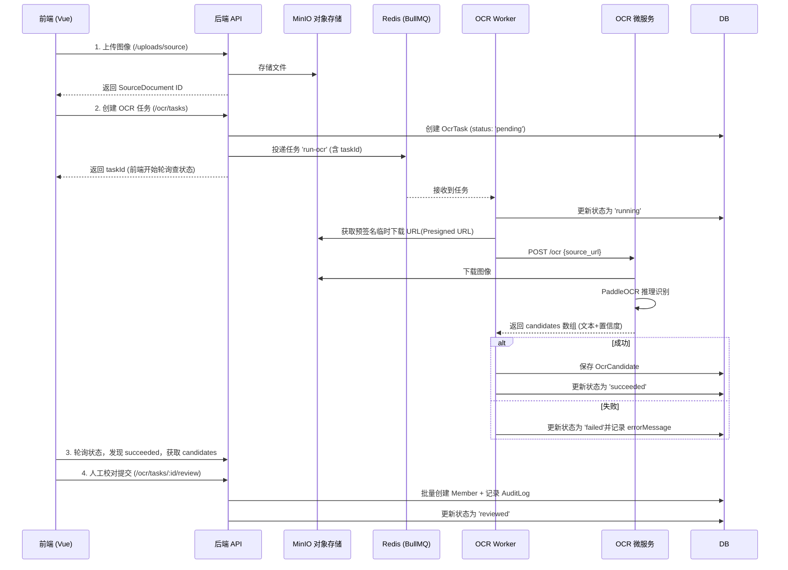
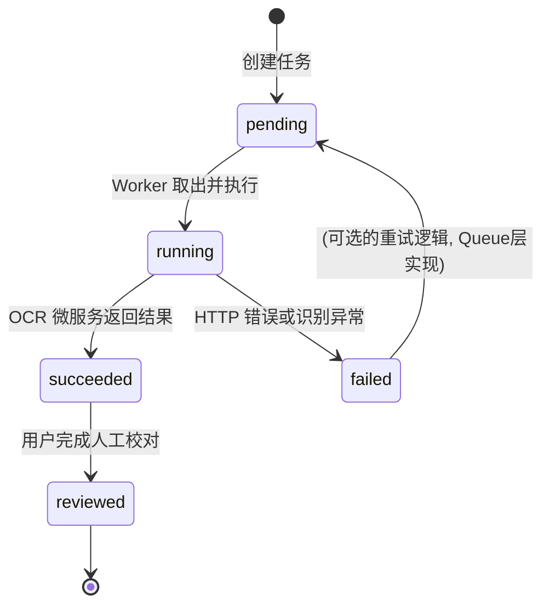

# 6. 关键执行流程 (Execution Paths)

本节分析了 Zupu 核心业务的几个关键执行路径。

## 1. 协作者修改审批流 (Edit Request Flow)

这是 v0.2 版本引入的核心协作机制。保证了非创建者只能提交修改意向，由管理员审批后才实际生效。

## 2. OCR 异步识别流 (OCR Processing Flow)

该流程展示了如何利用 Redis 队列解决耗时的深度学习 OCR 推理过程，保证 API 响应不被阻塞。

## 3. OCR 任务状态转移机 (State Machine)

