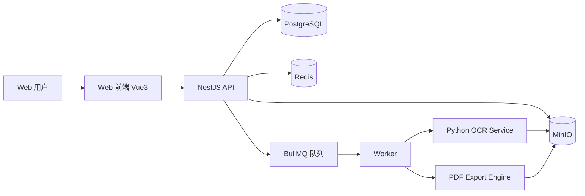

# 族谱系统系统设计文档（A方案）

- 日期：2026-04-01
- 设计基线：A方案（Vue3 + NestJS + PostgreSQL + Redis/BullMQ + MinIO + Python OCR）
- 对齐文档：
  - 需求分析文档：../requirements/2026-04-01-zupu-requirements-analysis.md
  - 技术选型文档：../tech-selection/2026-04-01-zupu-tech-selection-report.md

## 1. 设计目标与范围

设计目标：
1. 在2-4周内交付MVP，确保P0功能全部可用。
2. 满足3000成员规模下检索/详情查询P95 < 1s。
3. 保持前后端分离与低成本可运维，支持后续上云演进。

MVP范围（In Scope）：
1. 多家族逻辑隔离。
2. 管理员/编辑/访客角色模型。
3. 字段级可见性控制。
4. OCR导入 + 人工校对 + 入库。
5. 成员与基础关系（父母/子女/配偶）。
6. 检索与关系浏览。
7. PDF导出与操作日志追溯。

不在范围（Out of Scope）：
1. 复杂关系模型（过继、多配偶、养子女）。
2. 审批流。
3. 全自动OCR入库。

## 2. 总体架构

采用“前后端分离 + 异步任务 + OCR独立服务”架构。

核心原则：
1. 同步请求只处理轻量事务，耗时任务（OCR/导出）全部异步化。
2. API层统一执行租户隔离与权限校验。
3. OCR服务通过HTTP协议解耦，支持后续替换。

## 3. 服务与模块划分

### 3.1 Web前端（apps/web）

模块：
1. 登录与家族切换。
2. 成员列表与检索页。
3. 成员详情与关系浏览。
4. OCR任务与校对台。
5. 导出中心。
6. 审计日志页。

技术与状态管理：
1. Vue 3 + TypeScript + Vite。
2. Pinia管理会话、租户上下文、权限缓存。
3. Vue Router进行页面路由与权限守卫。

### 3.2 API服务（apps/api）

领域模块：
1. auth：鉴权、JWT、角色校验。
2. families：家族空间与成员角色管理。
3. members：成员资料CRUD、去重提示、基础关系管理。
4. visibility：字段级可见策略。
5. sources：原始图片上传与存储元数据。
6. ocr：任务创建、候选结果查询、校对确认入库。
7. search：姓名/辈分检索。
8. exports：PDF导出任务与下载。
9. audits：审计日志写入与查询。
10. jobs：BullMQ任务分发与状态追踪。

### 3.3 OCR服务（apps/ocr-service）

职责：
1. 接收图片URL或对象存储Key。
2. 执行PaddleOCR识别。
3. 返回结构化候选字段与置信度。
4. 回传API任务状态。

约束：
1. OCR服务不直接写业务数据库。
2. 仅通过API契约返回识别结果。

## 4. 数据模型设计（需求视角落地）

### 4.1 核心实体

1. Family
- id, name, code, createdAt

2. User
- id, username, passwordHash, status

3. FamilyUserRole
- id, familyId, userId, role(admin/editor/viewer)

4. Member
- id(UUID), familyId, name, generation, gender, birthDate, deathDate, alias, notes, isLiving, createdBy, createdAt

5. Relationship
- id, familyId, fromMemberId, toMemberId, type(parent_of/spouse_of), createdAt

6. VisibilityPolicy
- id, familyId, role, fieldName, isVisible

7. SourceDocument
- id, familyId, objectKey, filename, mimeType, uploadedBy, uploadedAt

8. OcrTask
- id, familyId, sourceDocumentId, status(pending/running/succeeded/failed/reviewed), errorMessage, createdAt

9. OcrCandidate
- id, ocrTaskId, fieldName, fieldValue, confidence, bboxJson

10. ExportTask
- id, familyId, type(pdf), status, objectKey, requestedBy, createdAt

11. AuditLog
- id, familyId, userId, action, targetType, targetId, metadataJson, createdAt

### 4.2 索引与约束

1. Member：index(familyId, name), index(familyId, generation)
2. Relationship：unique(familyId, fromMemberId, toMemberId, type)
3. FamilyUserRole：unique(familyId, userId)
4. OcrTask：index(familyId, status, createdAt)
5. AuditLog：index(familyId, createdAt), index(familyId, targetType, targetId)

## 5. 关键流程设计

### 5.1 OCR入库流程

1. 编辑上传图片到MinIO，创建SourceDocument。
2. API创建OcrTask(pending)并投递BullMQ。
3. Worker调用OCR服务执行识别。
4. OCR结果写入OcrCandidate，任务置为succeeded。
5. 编辑在校对台修正字段并确认。
6. API按校对结果写入Member/Relationship，任务置为reviewed。
7. 全流程写入AuditLog。

异常分支：
1. OCR失败：任务置为failed并记录errorMessage。
2. 校对冲突：返回冲突项，阻止入库直到人工处理。

### 5.2 检索与关系浏览流程

1. 用户输入姓名/辈分条件。
2. API在familyId作用域执行查询。
3. 根据角色与VisibilityPolicy过滤字段。
4. 返回成员列表与可见字段。
5. 详情页可按关系查询父母、配偶、子女。

### 5.3 导出流程

1. 管理员发起导出任务。
2. API创建ExportTask并投递队列。
3. Worker拉取家族数据并渲染HTML模板。
4. 通过Playwright/Puppeteer生成PDF并上传MinIO。
5. 更新任务状态并返回下载链接。

## 6. API边界（MVP）

鉴权：
1. POST /api/auth/login
2. GET /api/auth/me

家族与角色：
1. GET /api/families
2. POST /api/families/:id/users

成员与关系：
1. GET /api/members
2. POST /api/members
3. PATCH /api/members/:id
4. DELETE /api/members/:id
5. POST /api/members/:id/relations

OCR：
1. POST /api/ocr/tasks
2. GET /api/ocr/tasks/:id
3. GET /api/ocr/tasks/:id/candidates
4. POST /api/ocr/tasks/:id/review

导出：
1. POST /api/exports
2. GET /api/exports/:id

日志：
1. GET /api/audits

## 7. 权限与安全设计

1. JWT鉴权，API网关层解出userId与familyId上下文。
2. RBAC：管理员/编辑/访客。
3. 字段级权限：响应前按VisibilityPolicy过滤字段。
4. 租户隔离：所有查询强制追加familyId条件。
5. 审计：关键写操作必须记录AuditLog。

## 8. 非功能与容量设计

性能目标：
1. 3000成员规模下，检索/详情P95 < 1s。
2. OCR与导出任务异步执行，不阻塞主请求。

可靠性：
1. 队列任务支持重试（默认3次，指数退避）。
2. 关键失败状态持久化，便于重处理。

可运维性：
1. Docker Compose一键启动核心依赖（PostgreSQL/Redis/MinIO）。
2. 健康检查端点：/health。

## 9. 部署设计（本地到上云）

本地开发：
1. docker-compose启动基础中间件。
2. API/Web/OCR本地进程启动。

上云演进：
1. API/Web/OCR容器化。
2. PostgreSQL迁移到托管数据库。
3. MinIO可替换为对象存储服务。

## 10. 测试策略

1. 单元测试：服务层规则、权限过滤、关系校验。
2. 集成测试：OCR任务流、导出任务流、租户隔离。
3. E2E测试：上传->OCR->校对->入库->检索->导出。
4. 性能测试：3000成员检索压测。

## 11. MVP落地顺序

1. 第1阶段：认证、家族、成员、关系、检索。
2. 第2阶段：上传、OCR任务、校对入库。
3. 第3阶段：导出、日志、权限可见策略。

## 12. 待技术评审决策

1. Prisma与TypeORM二选一（建议Prisma）。
2. OCR结果结构化规则（模板驱动或模型后处理）。
3. PDF模板引擎细节（Handlebars/Nunjucks）。
