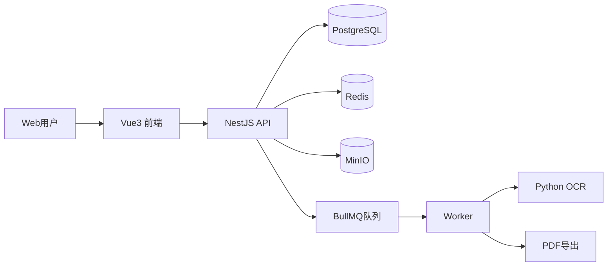
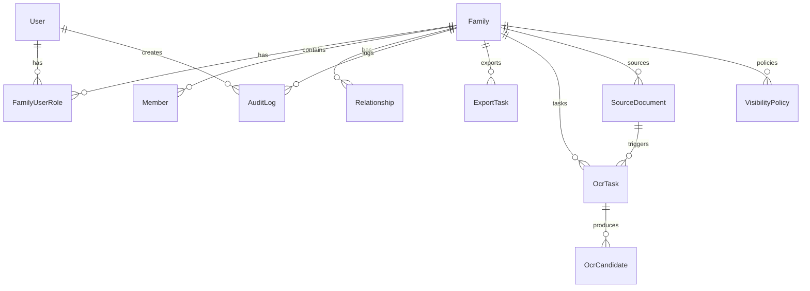
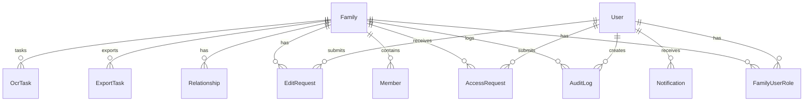
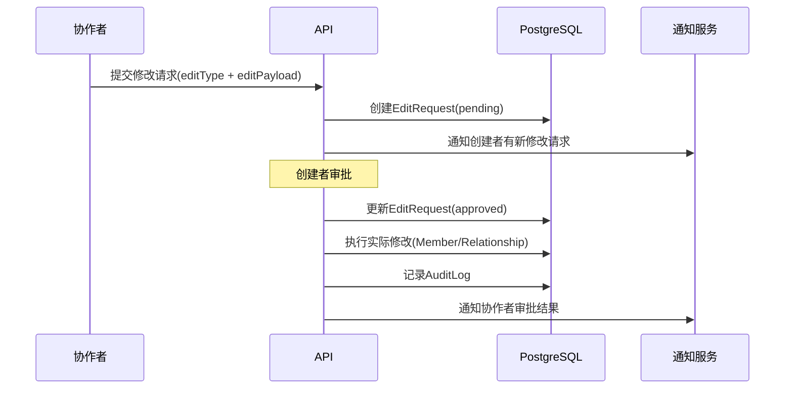
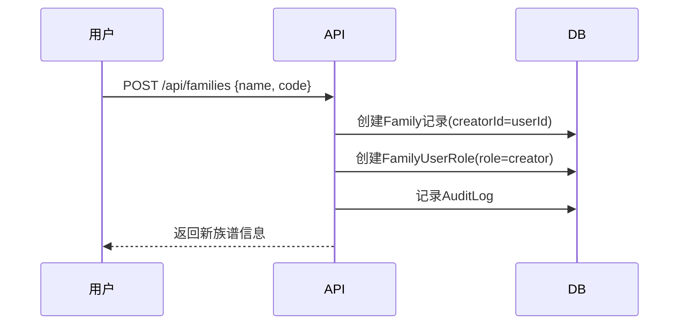
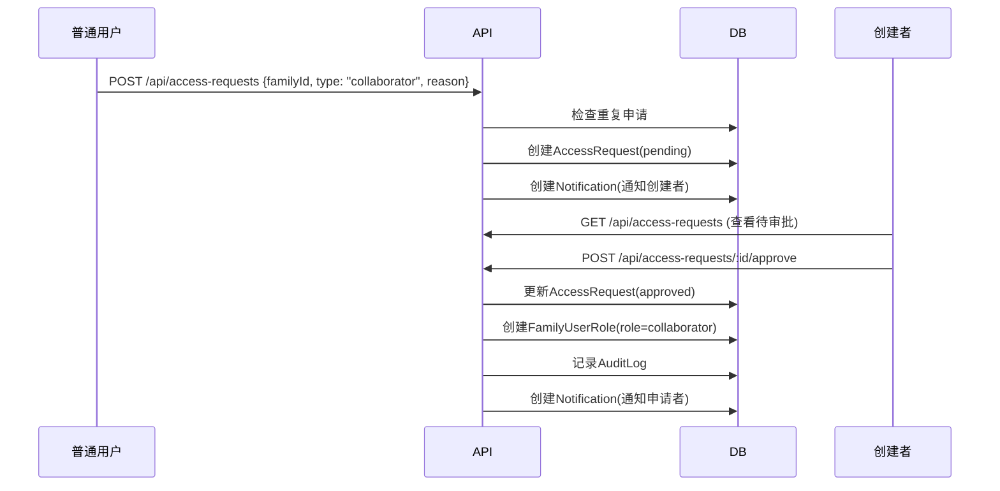
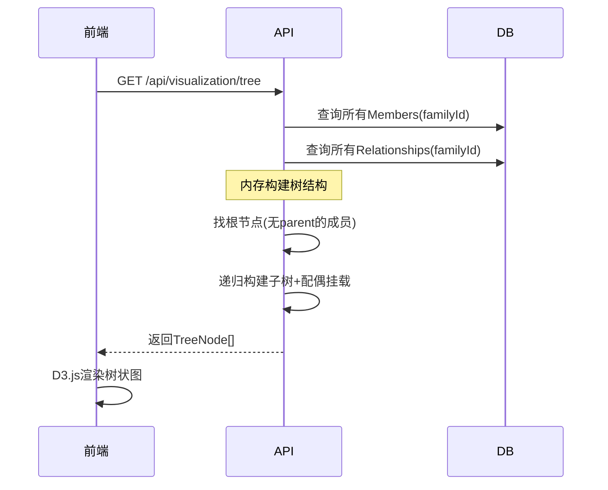

# 族谱数字化系统 v0.2 系统详细设计文档

> 基于 [v0.2需求分析文档](file:///d:/coding/personalProj/zupu/docs/requirements/2026-04-02-zupu-v0.2-requirements-analysis.md) 编写
> 对齐 [v0.1系统设计文档](file:///d:/coding/personalProj/zupu/docs/design/2026-04-01-zupu-system-design-a.md)

## 1. 设计目标与约束

**设计目标：**
1. 在v0.1基础上完成角色权限模型重构，支持四级权限体系
2. 实现族谱可视化功能（树状图+吊线图），3000人规模P95 < 2s
3. 修复audits日志不显示的问题，集成审计到各业务模块
4. 扩展PDF导出形式（吊线图版式、行传版式）

**技术约束：**
- 保持现有技术栈：Vue3 + NestJS + PostgreSQL + Prisma
- 不使用数据库外键级联（应用层保证一致性）
- 兼容v0.1已有数据

---

## 2. 现有架构分析

### 2.1 当前系统架构



### 2.2 当前后端模块一览

| 模块 | 路径 | 职责 |
|------|------|------|
| auth | `modules/auth/` | JWT鉴权、登录注册 |
| members | `modules/members/` | 成员CRUD、关系管理 |
| audits | `modules/audits/` | 审计日志写入与查询 |
| exports | `modules/exports/` | PDF导出任务 |
| ocr | `modules/ocr/` | OCR任务管理 |
| search | `modules/search/` | 姓名/辈分检索 |
| uploads | `modules/uploads/` | 文件上传 |

**基础设施层（infra）：**
- `prisma/` - 数据库ORM
- `families/` - 族谱租户隔离（通过`x-family-id`请求头）
- `queue/` - BullMQ任务队列
- `storage/` - MinIO对象存储

### 2.3 当前数据模型



当前 `Role` 枚举仅有：`admin` / `editor` / `viewer`

### 2.4 已识别的v0.1遗留问题

1. **audits日志不显示**：`AuditsService.create()` 已实现，但 `MembersService`/`ExportsService` 等业务模块未调用它
2. **权限模型过简**：仅3种角色，无法支持"族谱创建者独立管理自己族谱"的场景
3. **无可视化页面**：缺少树状图/吊线图展示
4. **导出形式单一**：仅有速查表版式

---

## 3. v0.2 数据模型变更设计

### 3.1 Prisma Schema 变更

> [!IMPORTANT]
> 以下所有新增表均不使用数据库级外键约束，关系一致性在应用层通过Service保证。但Prisma的`@relation`装饰器仍保留用于类型安全和查询便利（与v0.1保持一致的风格）。

#### 3.1.1 Role 枚举扩展

```diff
 enum Role {
   admin
-  editor
-  viewer
+  creator
+  collaborator
+  viewer
 }
```

- `admin`：应用管理员（系统级）
- `creator`：族谱创建者（族谱级，用户创建族谱时自动获得）
- `collaborator`：族谱协作者（族谱级，需申请并审批）
- `viewer`：普通查看者

> [!WARNING]
> 此枚举变更会影响所有现有的 `FamilyUserRole` 数据。需要编写迁移脚本将已有 `editor` 角色迁移为 `collaborator`。

#### 3.1.2 新增 AccessRequest 表（申请记录）

```prisma
enum AccessRequestStatus {
  pending
  approved
  rejected
}

enum AccessRequestType {
  collaborator
  viewer
}

model AccessRequest {
  id          String              @id @default(cuid())
  familyId    String
  userId      String
  type        AccessRequestType   // 申请成为协作者或查看者
  status      AccessRequestStatus @default(pending)
  reason      String?             // 申请理由
  reviewerId  String?             // 审批人ID
  reviewNote  String?             // 审批备注
  createdAt   DateTime            @default(now())
  updatedAt   DateTime            @updatedAt

  @@index([familyId, status])
  @@index([userId])
}
```

#### 3.1.3 新增 EditRequest 表（修改审批记录）

```prisma
enum EditRequestStatus {
  pending
  approved
  rejected
  revision_needed
}

model EditRequest {
  id            String            @id @default(cuid())
  familyId      String
  userId        String            // 提交修改的协作者
  editType      String            // 修改类型：member_create/member_update/member_delete/relation_create/relation_delete
  editPayload   String            // JSON格式的修改内容
  reason        String?           // 修改原因
  status        EditRequestStatus @default(pending)
  reviewerId    String?
  reviewNote    String?
  createdAt     DateTime          @default(now())
  updatedAt     DateTime          @updatedAt

  @@index([familyId, status])
  @@index([userId])
}
```

#### 3.1.4 Family 表扩展（公开程度配置）

```diff
 model Family {
   id          String           @id @default(cuid())
   name        String
   code        String           @unique
+  creatorId   String?          // 创建者用户ID
+  visibility  String           @default("approval_required") // "public" | "approval_required"
   createdAt   DateTime         @default(now())
-  users       FamilyUserRole[]
-  members     Member[]
   ...
 }
```

#### 3.1.5 新增 Notification 表（站内通知）

```prisma
model Notification {
  id          String   @id @default(cuid())
  userId      String   // 接收通知的用户
  type        String   // 通知类型：access_request/access_approved/access_rejected/edit_request/edit_approved/edit_rejected
  title       String
  content     String?
  relatedId   String?  // 关联的请求ID
  isRead      Boolean  @default(false)
  createdAt   DateTime @default(now())

  @@index([userId, isRead])
  @@index([userId, createdAt])
}
```

### 3.2 完整ER图（v0.2）



---

## 4. 后端模块设计

### 4.1 新增/变更模块清单

| 模块 | 类型 | 路径 | 职责 |
|------|------|------|------|
| families | **变更** | `modules/families/` | 从infra提升为业务模块，增加创建族谱、配置公开程度 |
| access-requests | **新增** | `modules/access-requests/` | 协作者/查看者申请与审批 |
| edit-requests | **新增** | `modules/edit-requests/` | 协作者修改请求与审批 |
| notifications | **新增** | `modules/notifications/` | 站内通知管理 |
| visualization | **新增** | `modules/visualization/` | 树状图/吊线图数据构建 |
| members | **变更** | `modules/members/` | 集成审计日志、权限校验 |
| exports | **变更** | `modules/exports/` | 集成审计日志、新增导出版式 |
| auth | **变更** | `modules/auth/` | JWT payload中增加多族谱角色信息 |

### 4.2 权限守卫设计

新增 `RolesGuard`，基于NestJS自定义装饰器+守卫模式：

```typescript
// common/decorators/roles.decorator.ts
export const Roles = (...roles: Role[]) => SetMetadata('roles', roles);

// common/guards/roles.guard.ts
@Injectable()
export class RolesGuard implements CanActivate {
  canActivate(context: ExecutionContext): boolean {
    const requiredRoles = this.reflector.get<Role[]>('roles', context.getHandler());
    if (!requiredRoles) return true;
    
    const request = context.switchToHttp().getRequest();
    const user = request.user;
    const familyId = request.headers['x-family-id'];
    
    // 从数据库查询用户在当前族谱中的角色
    // 权限继承：admin > creator > collaborator > viewer
    return this.checkRole(user.sub, familyId, requiredRoles);
  }
}
```

**使用方式示例：**
```typescript
@Roles('admin', 'creator')
@UseGuards(JwtAuthGuard, RolesGuard)
@Post('approve')
approveRequest() { ... }
```

### 4.3 Families 模块重构

**将 `infra/families/` 提升为 `modules/families/`**，增加以下能力：

```typescript
// modules/families/families.service.ts
class FamiliesService {
  // 保留原有
  resolveByCode(code: string): Family;
  
  // v0.2 新增
  createFamily(userId: string, dto: CreateFamilyDto): Family;  // 创建族谱并自动授予creator角色
  updateVisibility(familyId: string, visibility: string): Family;  // 更新公开程度
  getUserRole(userId: string, familyId: string): FamilyUserRole | null;  // 查询用户角色
  listFamiliesForUser(userId: string): Family[];  // 查询用户可访问的族谱列表
  addUserRole(familyId: string, userId: string, role: Role): FamilyUserRole;  // 添加用户角色
  removeUserRole(familyId: string, userId: string): void;  // 移除用户角色
}
```

### 4.4 AccessRequests 模块

```typescript
// modules/access-requests/access-requests.service.ts
class AccessRequestsService {
  create(userId: string, familyId: string, dto: CreateAccessRequestDto): AccessRequest;
  list(familyId: string, status?: AccessRequestStatus): AccessRequest[];
  listByUser(userId: string): AccessRequest[];
  approve(requestId: string, reviewerId: string, note?: string): AccessRequest;
  reject(requestId: string, reviewerId: string, note: string): AccessRequest;
}
```

**关键业务规则：**
1. 提交申请时检查：用户是否已有该族谱权限、是否已有待审批申请
2. 审批通过时自动调用 `FamiliesService.addUserRole()` 授予角色
3. 审批操作记录审计日志
4. 审批结果发送通知给申请者

### 4.5 EditRequests 模块

```typescript
// modules/edit-requests/edit-requests.service.ts
class EditRequestsService {
  create(userId: string, familyId: string, dto: CreateEditRequestDto): EditRequest;
  list(familyId: string, status?: EditRequestStatus): EditRequest[];
  approve(requestId: string, reviewerId: string): EditRequest;  // 通过后自动执行修改
  reject(requestId: string, reviewerId: string, note: string): EditRequest;
  requestRevision(requestId: string, reviewerId: string, note: string): EditRequest;
}
```

**修改审批流程：**



### 4.6 Visualization 模块

```typescript
// modules/visualization/visualization.service.ts
class VisualizationService {
  // 获取树状图数据 - 返回嵌套树结构
  getTreeData(familyId: string): TreeNode[];
  
  // 获取吊线图数据 - 返回按世代分组的扁平结构
  getDropLineData(familyId: string): GenerationGroup[];
}

// 树状图节点结构
interface TreeNode {
  id: string;
  name: string;
  generation?: number;
  gender?: string;
  isLiving: boolean;
  spouse?: { id: string; name: string; };
  children: TreeNode[];
}

// 吊线图世代分组
interface GenerationGroup {
  generation: number;
  members: MemberWithRelations[];
}
```

**数据构建策略：**
1. 一次性查询所有Members和Relationships
2. 在内存中构建树结构（避免N+1递归查询）
3. 找到根节点（没有parent的成员）并递归构建子树
4. 配偶关系并排到对应节点

### 4.7 Audits 集成方案

在 `MembersService` 和 `ExportsService` 的关键操作中注入 `AuditsService`：

```diff
 // members.service.ts
 @Injectable()
 export class MembersService {
   constructor(
     private readonly prisma: PrismaService,
     private readonly familiesService: FamiliesService,
+    private readonly auditsService: AuditsService,
   ) {}
 
   async create(familyCode: string, dto: CreateMemberDto, userId?: string) {
     // ... 创建逻辑
     const member = await this.prisma.member.create({ ... });
+    await this.auditsService.create({
+      familyId: family.id,
+      userId,
+      action: 'member_created',
+      targetType: 'Member',
+      targetId: member.id,
+      metadata: { name: dto.name },
+    });
     return member;
   }
```

需要集成审计的操作：
- `MembersService`: create / update / delete
- `MembersService`: createRelation（关系管理）
- `ExportsService`: createTask
- `AccessRequestsService`: approve / reject
- `EditRequestsService`: approve / reject

### 4.8 Exports 扩展设计

在 `ExportTask` 表中增加 `type` 字段：

```diff
 model ExportTask {
   id          String           @id @default(cuid())
   familyId    String
+  type        String           @default("quick_table")  // "quick_table" | "drop_line" | "biography"
   status      ExportTaskStatus @default(pending)
   ...
 }
```

新增两个导出渲染器：
1. **DropLineRenderer**：按世代垂直排列，每代横向排列所有同辈成员，连线展示血缘关系
2. **BiographyRenderer（欧式行传）**：参考欧式行传格式（横排表格），每人一列，包含：
   - 世代编号（`generation`字段）
   - 姓名（`name`字段）
   - 字号（`alias`字段）
   - 父亲：通过Relationship查询 `parent_of` 关系得到
   - 配偶：通过Relationship查询 `spouse_of` 关系得到（配偶信息含姓名）
   - 存殁状态（`isLiving`字段）
   - 简介/行传正文（`notes`字段）
   - **无需新增字段**，所有内容来自现有字段+关系查询

---

## 5. 前端模块设计

### 5.1 新增页面/组件

| 页面/组件 | 路径 | 说明 |
|-----------|------|------|
| FamilyManagePage | `pages/FamilyManagePage.vue` | 族谱管理（创建族谱、公开配置、成员权限管理） |
| AccessRequestsPage | `pages/AccessRequestsPage.vue` | 申请审批列表 |
| VisualizationPage | `pages/VisualizationPage.vue` | 可视化页面（树状图/吊线图切换） |
| TreeChart | `components/viz/TreeChart.vue` | 树状图组件（D3.js） |
| DropLineChart | `components/viz/DropLineChart.vue` | 吊线图组件（D3.js） |
| NotificationBell | `components/NotificationBell.vue` | 顶部通知铃铛 |

### 5.2 路由变更

```diff
 routes: [
   { path: '/', redirect: '/members' },
   { path: '/login', component: LoginPage },
+  { path: '/families', component: FamilyManagePage },
   { path: '/members', component: MembersPage },
   { path: '/members/:id', component: MemberDetailPage },
+  { path: '/visualization', component: VisualizationPage },
   { path: '/ocr', component: OcrPage },
   { path: '/exports', component: ExportsPage },
   { path: '/audits', component: AuditsPage },
+  { path: '/requests', component: AccessRequestsPage },
 ]
```

### 5.3 可视化技术选型

> [!IMPORTANT]
> **推荐D3.js**，理由：
> 1. 对树状层级数据有原生支持（`d3-hierarchy`）
> 2. 自定义能力强，可实现传统族谱吊线图版式
> 3. 支持Canvas渲染，3000人规模性能有保障
> 4. 开源免费，社区成熟
>
> ECharts也可考虑（开发更快但自定义受限），GoJS商业收费不推荐。

**前端新增依赖：**
```json
{
  "d3": "^7.x",
  "@types/d3": "^7.x"
}
```

### 5.4 树状图交互设计

```
┌─────────────────────────────────────────────┐
│  [搜索成员...]  [全屏]  [缩放+] [缩放-]    │
│                                             │
│          ┌──────┐                           │
│          │ 始祖 │                           │
│          └──┬───┘                           │
│       ┌─────┼─────┐                         │
│    ┌──┴──┐     ┌──┴──┐                      │
│    │ 长子│     │ 次子│                       │
│    └──┬──┘     └──┬──┘                      │
│    ┌──┴──┐     ┌──┴──┐                      │
│    │ 孙辈│     │ 孙辈│                       │
│    └─────┘     └─────┘                      │
│                                             │
│  [展开全部]  [收起到第N代]                   │
└─────────────────────────────────────────────┘
```

**交互功能：**
- 点击节点→展开/收起子树、查看详情
- 拖拽平移、滚轮缩放
- 搜索定位特定成员（高亮+居中）
- 初始默认展开前3代，深层按需加载

---

## 6. API 接口设计

### 6.1 新增接口清单

**族谱管理：**
| 方法 | 路径 | 说明 | 权限 |
|------|------|------|------|
| POST | `/api/families` | 创建族谱 | 已登录 |
| GET | `/api/families` | 获取用户族谱列表 | 已登录 |
| PATCH | `/api/families/:id/visibility` | 更新公开程度 | admin/creator |
| GET | `/api/families/:id/roles` | 获取族谱成员角色列表 | admin/creator |
| DELETE | `/api/families/:id/roles/:userId` | 移除用户角色 | admin/creator |

**申请管理：**
| 方法 | 路径 | 说明 | 权限 |
|------|------|------|------|
| POST | `/api/access-requests` | 提交协作/查看申请 | 已登录 |
| GET | `/api/access-requests` | 查询申请列表（按族谱） | admin/creator/collaborator |
| GET | `/api/access-requests/mine` | 查询我的申请 | 已登录 |
| POST | `/api/access-requests/:id/approve` | 审批通过 | admin/creator/collaborator |
| POST | `/api/access-requests/:id/reject` | 审批拒绝 | admin/creator/collaborator |

**修改审批：**
| 方法 | 路径 | 说明 | 权限 |
|------|------|------|------|
| POST | `/api/edit-requests` | 提交修改请求 | collaborator |
| GET | `/api/edit-requests` | 查询修改请求列表 | admin/creator |
| POST | `/api/edit-requests/:id/approve` | 审批通过并执行 | admin/creator |
| POST | `/api/edit-requests/:id/reject` | 审批拒绝 | admin/creator |

**可视化：**
| 方法 | 路径 | 说明 | 权限 |
|------|------|------|------|
| GET | `/api/visualization/tree` | 获取树状图数据 | viewer+ |
| GET | `/api/visualization/dropline` | 获取吊线图数据 | viewer+ |

**通知：**
| 方法 | 路径 | 说明 | 权限 |
|------|------|------|------|
| GET | `/api/notifications` | 获取通知列表 | 已登录 |
| PATCH | `/api/notifications/:id/read` | 标记已读 | 已登录 |
| GET | `/api/notifications/unread-count` | 获取未读数量 | 已登录 |

### 6.2 变更接口

| 方法 | 路径 | 变更说明 |
|------|------|----------|
| POST | `/api/exports` | 增加 `type` 参数（"quick_table" / "drop_line" / "biography"） |
| GET | `/api/auth/me` | 返回值增加多族谱角色列表 |
| POST/PATCH/DELETE | `/api/members/*` | 增加审计日志记录 |

---

## 7. 关键流程设计

### 7.1 族谱创建与授权流程



### 7.2 协作者申请与审批流程



### 7.3 树状图数据加载流程



---

## 8. 数据迁移方案

### 8.1 Role 枚举迁移

```sql
-- 1. 添加新枚举值
ALTER TYPE "Role" ADD VALUE IF NOT EXISTS 'creator';
ALTER TYPE "Role" ADD VALUE IF NOT EXISTS 'collaborator';

-- 2. 迁移现有数据
UPDATE "FamilyUserRole" SET role = 'collaborator' WHERE role = 'editor';

-- 3. (可选) 清理旧枚举值 - PostgreSQL不支持直接删除枚举值
-- 建议保留旧值以兼容，或通过重建枚举实现
```

### 8.2 Family 表迁移

```sql
-- 为现有族谱设置创建者（取第一个admin角色用户）
ALTER TABLE "Family" ADD COLUMN "creatorId" TEXT;
ALTER TABLE "Family" ADD COLUMN "visibility" TEXT NOT NULL DEFAULT 'approval_required';

UPDATE "Family" f 
SET "creatorId" = (
  SELECT fur."userId" FROM "FamilyUserRole" fur 
  WHERE fur."familyId" = f.id AND fur.role = 'admin' 
  LIMIT 1
);
```

---

## 9. 性能设计

### 9.1 可视化性能优化

**目标：** 3000人规模树状图初次加载 P95 < 2s

**策略：**
1. **后端一次性加载**：所有Members + Relationships一次查询，内存构建树
2. **前端Canvas渲染**：D3.js使用Canvas模式替代SVG（3000节点SVG会卡顿）
3. **分层渲染**：默认展开前3代，深层折叠，按需展开
4. **虚拟化**：只渲染视窗内可见节点

### 9.2 权限校验性能

- `RolesGuard` 查询缓存：同一请求内缓存用户角色查询结果
- 索引优化：`FamilyUserRole` 的 `@@unique([familyId, userId])` 已有唯一索引

---

## 已确认技术决策（2026-04-03）

> [!NOTE]
> 以下所有问题均已由用户确认，可直接进入开发。

| 决策项 | 确认结果 |
|--------|----------|
| 可视化组件 | ✅ **D3.js**（d3-hierarchy + SVG/Canvas） |
| Role枚举变更 | ✅ **editor→collaborator，新增creator**，配迁移脚本 |
| 通知机制 | ✅ **前端10s HTTP长轮询**查询未读数量，非WebSocket |
| 行传版式 | ✅ **欧式行传**（横排表格），内容来自现有字段+关系查询，无需新增字段 |

---

## Proposed Changes

### 后端变更（apps/api）

---

#### Prisma Schema
##### [MODIFY] [schema.prisma](file:///d:/coding/personalProj/zupu/apps/api/prisma/schema.prisma)
- 扩展Role枚举：移除`editor`改为`creator`+`collaborator`
- Family表新增`creatorId`和`visibility`字段
- ExportTask新增`type`字段
- 新增`AccessRequest`、`EditRequest`、`Notification`三张表和对应枚举

---

#### 权限守卫
##### [NEW] `src/common/decorators/roles.decorator.ts`
- `@Roles(...)` 自定义装饰器

##### [NEW] `src/common/guards/roles.guard.ts`
- RolesGuard：基于`x-family-id`查询用户角色并校验

---

#### Families 模块重构
##### [MODIFY] [families.service.ts](file:///d:/coding/personalProj/zupu/apps/api/src/infra/families/families.service.ts)
- 提升为业务模块：新增 createFamily、updateVisibility、getUserRole、listFamiliesForUser、addUserRole、removeUserRole

##### [NEW] `src/modules/families/families.controller.ts`
- 族谱管理REST接口

---

#### Access Requests 模块
##### [NEW] `src/modules/access-requests/access-requests.module.ts`
##### [NEW] `src/modules/access-requests/access-requests.service.ts`
##### [NEW] `src/modules/access-requests/access-requests.controller.ts`
##### [NEW] `src/modules/access-requests/dto/`
- 完整申请审批CRUD

---

#### Edit Requests 模块
##### [NEW] `src/modules/edit-requests/edit-requests.module.ts`
##### [NEW] `src/modules/edit-requests/edit-requests.service.ts`
##### [NEW] `src/modules/edit-requests/edit-requests.controller.ts`
##### [NEW] `src/modules/edit-requests/dto/`
- 完整修改请求审批CRUD

---

#### Notifications 模块
##### [NEW] `src/modules/notifications/notifications.module.ts`
##### [NEW] `src/modules/notifications/notifications.service.ts`
##### [NEW] `src/modules/notifications/notifications.controller.ts`
- 通知查询、标记已读

---

#### Visualization 模块
##### [NEW] `src/modules/visualization/visualization.module.ts`
##### [NEW] `src/modules/visualization/visualization.service.ts`
##### [NEW] `src/modules/visualization/visualization.controller.ts`
- 树状图/吊线图数据构建API

---

#### 现有模块变更
##### [MODIFY] [members.service.ts](file:///d:/coding/personalProj/zupu/apps/api/src/modules/members/members.service.ts)
- 注入AuditsService，在create/update/delete/createRelation中记录审计日志
- create/update/delete方法增加`userId`参数

##### [MODIFY] [members.controller.ts](file:///d:/coding/personalProj/zupu/apps/api/src/modules/members/members.controller.ts)
- 添加 `@UseGuards(JwtAuthGuard, RolesGuard)` 和 `@Roles()` 装饰器
- 从JWT解出userId传入service

##### [MODIFY] [exports.service.ts](file:///d:/coding/personalProj/zupu/apps/api/src/modules/exports/exports.service.ts)
- 注入AuditsService，createTask记录审计日志
- 新增吊线图/行传渲染逻辑（基于`type`参数分派）

##### [MODIFY] [app.module.ts](file:///d:/coding/personalProj/zupu/apps/api/src/app.module.ts)
- 注册新模块：FamiliesModule、AccessRequestsModule、EditRequestsModule、NotificationsModule、VisualizationModule

---

### 前端变更（apps/web）

---

#### 新增页面
##### [NEW] `src/pages/FamilyManagePage.vue` - 族谱管理
##### [NEW] `src/pages/AccessRequestsPage.vue` - 申请审批
##### [NEW] `src/pages/VisualizationPage.vue` - 可视化（树状图/吊线图切换）

#### 新增组件
##### [NEW] `src/components/viz/TreeChart.vue` - D3.js 树状图
##### [NEW] `src/components/viz/DropLineChart.vue` - D3.js 吊线图
##### [NEW] `src/components/NotificationBell.vue` - 通知铃铛

#### 变更文件
##### [MODIFY] [router.ts](file:///d:/coding/personalProj/zupu/apps/web/src/router.ts) - 添加新路由
##### [MODIFY] [api.ts](file:///d:/coding/personalProj/zupu/apps/web/src/services/api.ts) - 添加新接口调用
##### [NEW] `src/stores/family.ts` - 族谱状态管理
##### [NEW] `src/stores/notifications.ts` - 通知状态管理

---

## Open Questions

> [!IMPORTANT]
> 1. **可视化组件是否选D3.js？** 如果偏好ECharts也可调整。
> 2. **通知机制MVP阶段仅站内通知**——是否可以接受轮询（每30s查一次未读数量），而不做WebSocket实时推送？
> 3. **吊线图排版规范**——是否有具体的传统吊线图样本可参考？
> 4. **行传版式**——每个成员的"行传"内容来源是`notes`字段，还是需要新增专用字段？

---

## Verification Plan

### 自动化测试

**后端单元测试**（已有Jest基础设施，运行命令：`cd apps/api && npm test`）：

1. **权限守卫测试** - 新增 `src/common/guards/roles.guard.spec.ts`
   - 测试admin可访问所有接口
   - 测试creator权限校验
   - 测试越权访问被拦截

2. **AccessRequestsService测试** - 新增 `src/modules/access-requests/access-requests.service.spec.ts`
   - 测试创建申请、重复申请拦截、审批通过自动授权、审批拒绝

3. **EditRequestsService测试** - 新增 `src/modules/edit-requests/edit-requests.service.spec.ts`
   - 测试提交修改请求、审批通过执行修改

4. **VisualizationService测试** - 新增 `src/modules/visualization/visualization.service.spec.ts`
   - 测试树结构正确构建、配偶关系挂载

5. **MembersService审计集成测试** - 修改 `src/modules/members/members.service.spec.ts`
   - 测试create/update/delete时AuditsService.create被调用

**运行命令：**
```bash
cd d:\coding\personalProj\zupu\apps\api
npm test
```

### 手动验证

> [!TIP]
> 以下步骤需要先启动开发环境（`docker-compose up -d` + `cd apps/api && npm run start:dev` + `cd apps/web && npm run dev`），然后在浏览器中操作。

1. **权限流程验证**：
   - 注册新用户 → 创建族谱 → 确认自动获得creator角色
   - 另一用户申请协作 → 创建者审批 → 验证角色生效

2. **审计日志验证**：
   - 创建/编辑/删除成员 → 检查audits页面有对应日志

3. **可视化验证**：
   - 录入多代成员和关系 → 打开可视化页面
   - 检查树状图正确展示父子/配偶关系
   - 测试缩放、拖拽、节点点击

4. **导出验证**：
   - 选择不同版式导出 → 下载PDF → 检查内容正确
